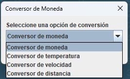
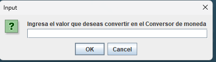
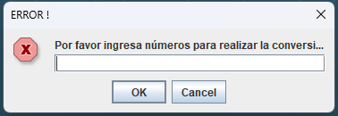
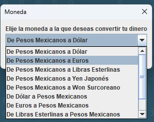
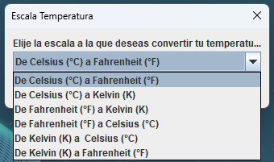
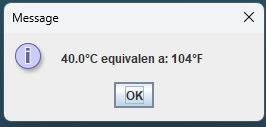
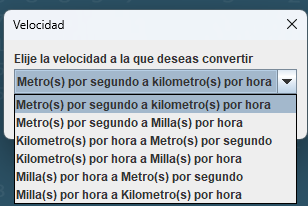
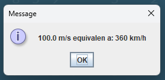
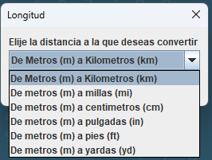
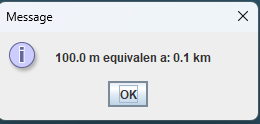

<h1 align="ceter"> Conversor de Monedas </h1>

Repositorio creado para el Challenge Conversor de monedas - Oracle Next Education y Alura Latam

<div align="center">

</div>


## Índice
- [Índice](#índice)
- [Descripción](#descripción)
- [:sparkles: Requisitos del programa](#sparkles-requisitos-del-programa)
- [Extra](#extra)
- [:wrench: Tecnologías Utilizadas](#wrench-tecnologías-utilizadas)
- [:hammer: Funcionalidades](#hammer-funcionalidades)
    - [Conversor de Monedas](#conversor-de-monedas)
    - [Conversor de Temperatura](#conversor-de-temperatura)
    - [Conversor de Velocidad](#conversor-de-velocidad)
    - [Conversor de Distancia](#conversor-de-distancia)
- [Uso del Programa](#uso-del-programa)
    - [**Autor: Enrique Cocom Canul 👨‍💻🧙‍♂️**](#autor-enrique-cocom-canul-️)


## Descripción
El conversor de monedas es un programa que permite realizar conversiones de moneda, temperatura, velocidad y distancia.
Selecciona la opción de conversión y proporcionará una ventana para asignar el valor que deseas convertir, seguidamente se mostrara el resultado en la unidad selecciónada.

## :sparkles: Requisitos del programa

El convertidor tiene que llevar:

```
      - Convertir de la moneda de tu país a Dólar
      - Convertir de la moneda de tu país  a Euros
      - Convertir de la moneda de tu país  a Libras Esterlinas
      - Convertir de la moneda de tu país  a Yen Japonés
      - Convertir de la moneda de tu país  a Won sul-coreano
```
Recordando que también debe ser posible convertir inversamente:

```
      - Convertir de Dólar a la moneda de tu país
      - Convertir de Euros a la moneda de tu país
      - Convertir de Libras Esterlinas a la moneda de tu país
      - Convertir de Yen Japonés a la moneda de tu país
      - Convertir de Won sul-coreano a la moneda de tu país
```
## Extra

Como un extra podemos implementarle mas opciones al conversor como puede ser:

```
      - Temperatura
      - Kilometraje
      - Años luz
      - Longitud
```


## :wrench: Tecnologías Utilizadas
- [Java JDK 17](https://www.oracle.com/mx/java/technologies/downloads/#jdk17-windows)
- [IntelliJ IDEA](https://www.jetbrains.com/es-es/idea/download/?section=windows)

## :hammer: Funcionalidades
 

 


#### Conversor de Monedas

 

#### Conversor de Temperatura
 

#### Conversor de Velocidad
 

#### Conversor de Distancia
 

## Uso del Programa
1. Selecciona el tipo de conversión que deseas realizar: monedas, temperaturas, velocidad o distancia.
2. Ingresa el valor que deseas convertir.
3. Especifica la unidad de origen y la unidad de destino.
4. Haz clic en el botón "Convertir" para obtener el resultado de la conversión.
5. Para finalizar el programa haz clic en el botón "No" o "Cancelar" para terminar.

 

<h3 align="left">Connect with me:</h3>
<p align="left">
<a href="https://www.linkedin.com/in/enriquecocom/" target="blank"></a>
<a href="https://www.instagram.com/enrique_cocom04/" target="blank"></a>
</p>

--------------------------------------------------------------------------
#### **Autor: Enrique Cocom Canul 👨‍💻🧙‍♂️**